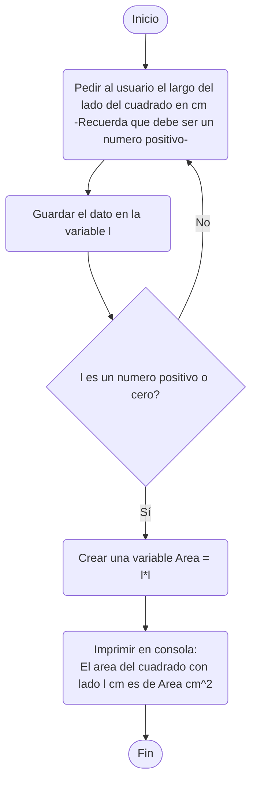
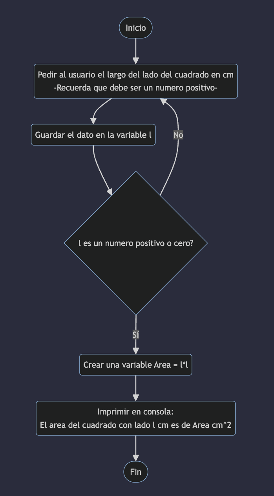

# Ejercicio 2

> Calcular el área de un cuadrado

1. Entrada? Cualquier cuadrado? más figuras? De donde los voy a tomar

2. Salida? Lo presentamos en pantalla? En la consola del navegador?

**Definición del problema**

> Quiero un programa de consola que determine el área de cualquier cuadrado tomando el valor por medio de un prompt en cm. Y el resultado se muestre en la consola del navegador.

Entrada: 
- Medida de un lado del cuadrado en cm

Salida: 
- En consola *"El area del cuadrado con lado [lado]cm es de [área]cm^2"*

Y si lo quiero como imágen?

